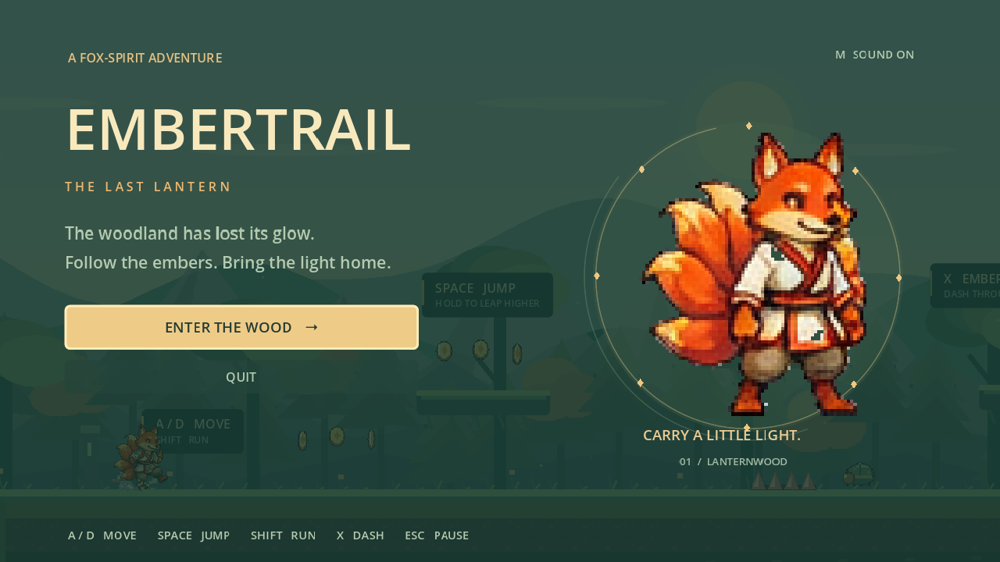

# Embertrail: The Last Lantern

An original, complete Godot 4 platformer prototype. Play a many-tailed fox spirit carrying light back to the Lanternwood. Reach the shrine at the far right; embers and high routes are optional score challenges.



For development and agent continuation, see the [workspace and workflow handoff](docs/AI_AGENT_HANDOFF.md).

## Run

Godot **4.7.1** was used for verification. No plugins or paid services are needed.

- **macOS:** double-click `launch_game.command`. It imports the local assets and launches the game with your installed Godot.
- **Godot editor:** import `project.godot` and press **F5**.
- **Terminal:** run `./launch_game.command`, or use the following commands from this folder:

```sh
godot --headless --path . --editor --import --quit
godot --path .
```

A pre-imported resource pack is included in `builds/embertrail.pck`. It runs with Godot 4.7.1 without the source project:

```sh
godot --main-pack builds/embertrail.pck
```

The pack is not a standalone executable. Native export templates are not installed on this machine; no installation was performed. The editable project is the recommended development entry point.

## Controls

| Input | Action |
| --- | --- |
| A / D or Left / Right | Move |
| Space, W, or Up | Jump; hold for a higher arc |
| Shift | Run |
| X or J | Ember dash; defeats beetles on contact |
| Escape or P | Pause / resume |
| R | Restart the entire journey |
| M | Toggle sound |
| F11 | Toggle fullscreen |
| Enter / mouse | Activate menu buttons |

Basic controller bindings are included: left stick to move, A to jump, X to dash, right shoulder to run, Start to pause. Physical controller hardware was not tested.

## Playing

- You begin with three hearts and three lives. Enemy contact and thorn beds cost hearts; pits cost a life.
- Jump onto beetles or dash through them. Dashing does **not** protect you from thorns.
- Release jump early for a short hop. Coyote time and jump buffering make edge jumps and quick landings forgiving.
- Run and jump across the four gaps. One-way platforms provide higher routes and more embers.
- Light either of two checkpoint lanterns to restore health and set your return point. Death preserves collected embers and defeated enemies; a full restart resets the level.
- Reach the final shrine to finish. Score includes embers, defeated enemies, remaining lives, and a time bonus. No ember quota is required.

## Contents

- One 6,240-pixel level, 17 raised platforms, four gaps, five thorn beds, six patrolling beetles, 84 collectible embers, two checkpoints, and a final shrine.
- Responsive walk/run movement, acceleration/friction, variable jumping, coyote time, jump buffer, air dash, knockback, invulnerability, and death/respawn.
- Ten fox animation states with 42 playback frames assembled from 27 supplied sprites, animated items/enemies, local generated tile art, parallax scenery, dust/sparkle/defeat effects, landing squash, hurt flashing, and camera shake.
- Main menu, HUD, pause, game over, level complete, and replay flow.
- Eight synthesized sound effects and a quiet original looping music sketch.

## Main files

| File | Role |
| --- | --- |
| `scenes/main.tscn` / `scripts/main.gd` | Entry point, game states, audio, camera, scoring |
| `scenes/player.tscn` / `scripts/player.gd` | Player controller and sprite animations |
| `levels/lanternwood.tscn` / `scripts/level.gd` | Complete level layout and terrain |
| `scenes/enemy.tscn`, `collectible.tscn`, `hazard.tscn`, `checkpoint.tscn`, `level_goal.tscn` | Reusable gameplay objects |
| `ui/hud.tscn`, `ui/menus.tscn` | Reusable HUD and menu scenes |
| `tools/generate_assets.py` | Local player import, world-art and audio generation |
| `tools/generate_player.py` / `assets/sprites/player_frames.tres` | Supplied-art importer and ten animation states |
| `tests/run_checks.sh` | Import, behavioral tests, and physical full-level traversal |
| `docs/BUILD_PASSES.md` | Three build–test–refine passes and remaining limitations |
| `assets/ASSET_MANIFEST.md` | Asset layouts, palette, and provenance |
| `source_art/` | Preserved initial reference, larger character sheet, extra cuts, and legacy poses for future animation work |

Scenes construct much of their content in GDScript at runtime. Edit the layout arrays in `scripts/level.gd` to change terrain and platforms.

## Verification and rebuilding

```sh
./tests/run_checks.sh
python3 tools/generate_assets.py
godot --headless --path . --editor --import --quit
godot --headless --path . --export-pack 'Desktop Pack' builds/embertrail.pck
```

The final check includes **139 passing behavioral assertions** (101 game-flow checks and 38 character-specific checks) and a separate full-level run using only actual input actions and collisions. That route completed with 45 embers, both checkpoints, and all three lives. Import/runtime errors fail the test runner even when Godot returns exit code zero. Logs are in `tests/results/`.

To regenerate rendered screenshots of all five screens:

```sh
godot --path . --fixed-fps 60 --script res://tools/capture_screens.gd
```

The screenshot harness deliberately sets up screen states; the independent traversal test proves physical completion without teleports or health overrides.

## Character refinement

The player now uses 27 of your supplied fox sprites directly, preserving their face, swept tails, cream robe and burgundy trim. Feet are aligned across differently cropped images, with separate upright walking and leaning running cycles. The first expansion pass replaced the whole-image tilts that previously stood in for jump, fall, hurt and death with separately drawn poses from the same sheet, and split the airborne arc into ascent, apex and descent. Dash still animates a single supplied burst pose. The controller adds quicker turns/stops, separate rise/fall gravity, dedicated interruptible landing animation, a cleaner dash exit, short buffered hops, and reliable high-speed stomps.

See [supplied-art integration notes](docs/character/supplied/README.md) and [earlier controller notes](docs/character/REFINEMENT.md), the [interactive before/after animation review](docs/character/review.html), [motion study](docs/character/animation-review.mp4), and [rendered playthrough](docs/character/gameplay-review.mp4).

## Scope and next steps

This is a short, single-level prototype with one enemy type and synthesized placeholder audio. There is no persistent save system or rebinding/settings screen. Windows, Linux, touch, and controller hardware have not been tested. The authored UI is English and explicitly sets left-to-right layout.

Next: add a second biome, a second enemy pattern, bespoke music, remappable controls, and platform-specific standalone exports after installing the free export templates.

World graphics and audio were generated locally from original drawing/synthesis code. Player artwork uses 27 user-provided PNGs, preserved in assets/sprites/source_fox with provenance hashes recorded for every adopted crop. The original large reference image and additional pose sheet are archived under `source_art/` for future animation work; they are excluded from the runtime resource pack. No downloaded asset packs or paid services were used.
